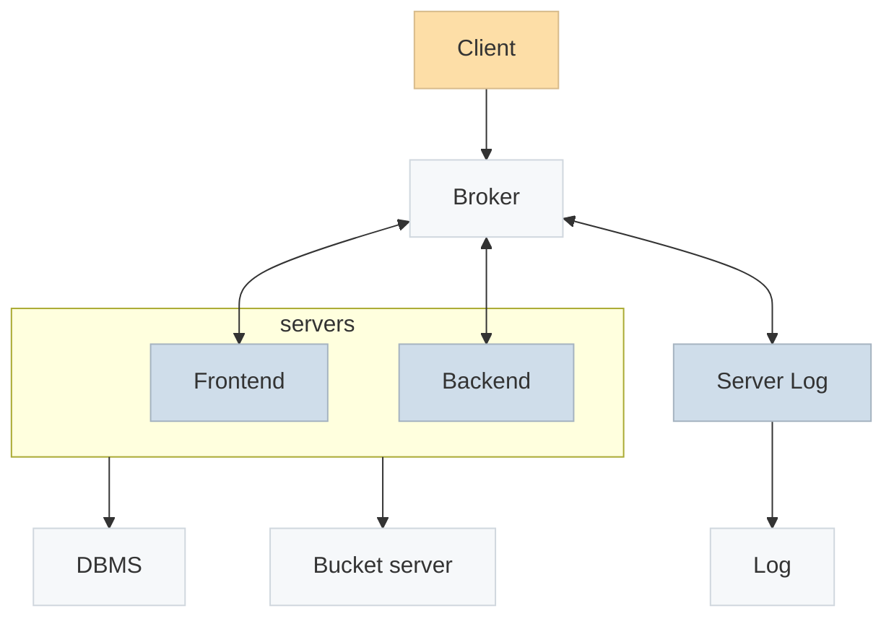

```mermaid
flowchart TD
    X[Client]
    A[Broker]
    X --> A
    subgraph servers
    B[Frontend]
    C[Backend]
    end
    A <--> B
    A <--> C
    A <--> E[Server Log]
    servers --> F[DBMS]
    servers --> G[Bucket server]
    E --> I[Log]
    style X fill:#FDDEA7,stroke:#d7bb8c
    style B fill:#CFDDEA,stroke:#A5B3C0
    style C fill:#CFDDEA,stroke:#A5B3C0
    style E fill:#CFDDEA,stroke:#A5B3C0

	style A fill:#F6F8FA,stroke:#D0D7DE
	style F fill:#F6F8FA,stroke:#D0D7DE
	style G fill:#F6F8FA,stroke:#D0D7DE
	style I fill:#F6F8FA,stroke:#D0D7DE
```