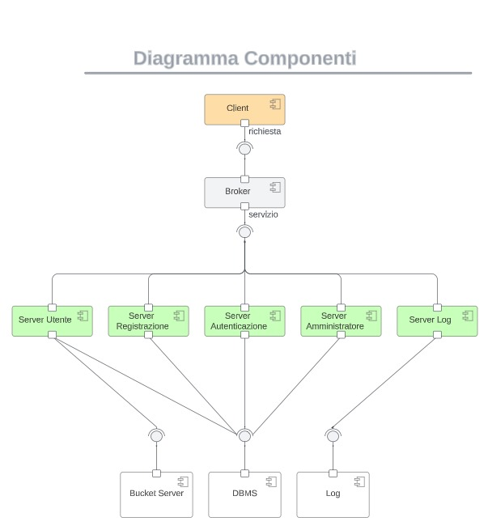

<!-- paginate: false -->

# Codemonkey

**Gruppo 11**
- Alessandro Ricci A.
0000978068
- Stefano Allevi
0000990314
- Valerio Iacobucci
0000976541

---

Codemonkey è un'applicazione che espone programmatori (**Codemonkeys**) a realtà lavorative che ne hanno bisogno (**Clienti**).

I clienti possono sfogliare i profili delle codemonkeys in base a **tag** e proporre loro una **collaborazione**, che la codemonkey può accettare o rifiutare.

A lavoro concluso, il cliente può valutare la collaborazione ed il profilo della codemonkey è aggiornato con la nuova **valutazione**.

---

# Modello dei dati

Codemonkey|Cliente
----------|-------
Modifica di email, password, descrizione|Modifica di email, password
Visualizzazione e gestione delle collaborazioni con possibilità di accettare, rifiutare, segnalare e interrompere collaborazioni|Visualizzazione e gestione delle collaborazioni con possibilità di terminare e valutare la Codemonkey
Selezione dei tag|

---

# Sviluppo
Gli sviluppatori lavorano in **feature branch** separati e **merge request** nella repository **git** del progetto.
Modalità di sviluppo

---

# Architettura

@startuml

Rest -> Nginx
Nginx -> Rails
Rails -> PostgreSQL
Rest <- Rails
Frontend <- Nginx

@enduml

---

# Implementazione

### Frontend
**Angular** è un framework orientato a componenti basato su *typescript*.
### Backend
**Rails** è un framework per app web con pattern MVC basato su *Ruby*.
### Database
**PostgreSQL** è un DBMS relazionale.
#### Reverse proxy
**Nginx** è un web server HTTP e reverse proxy.

---

# Deployment

Containerizzazione dell’applicazione tramite Docker, rilascio su Microsoft Azure.

Pro|Contro
---|------
Virtualizzazione (isolamento)|Sicurezza condivisa
Disponibilità|Costo maggiorato

Viene predisposto l'utilizzo di **object server** per il caricamento/scaricamento delle immagini di profilo, di **database server** per la gestione di entità e relazioni e **log server** per il salvataggio sequenziale di eventi, oltre a **servizi per container** per l'orchestrazione.
