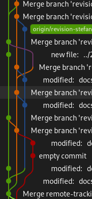

<script src="node_modules/mermaid/dist/mermaid.min.js"></script>

<script>mermaid.initialize({startOnLoad:true, theme:"neutral", mirrorActors:false});</script>
<link rel="stylesheet" href="res/styles.css">

# Codemonkey


**Gruppo 11**
- Alessandro Ricci A.
0000978068
- Stefano Allevi
0000990314
- Valerio Iacobucci
0000976541
---


Codemonkey è un'applicazione che espone programmatori (**Codemonkeys**) a realtà lavorative che ne hanno bisogno (**Clienti**).

I clienti possono sfogliare i profili delle codemonkeys in base a **tag** e proporre loro una **collaborazione**, che la codemonkey può accettare o rifiutare.

A lavoro concluso, il cliente può valutare la collaborazione ed il profilo della codemonkey è aggiornato con la nuova **valutazione**.

---
<div class="container">
<div class="content" style="height:100%">

## Codemonkey
- Modifica di dati personali (email, password, bio)
- Gestione delle collaborazioni
    - Accettazione
    - Rifiuto
    - Interruzione
- Gestione dei tag personali
    - Aggiunta
    - Rimozione
    - Proposta
</div>

<div class="content" style="height:100%">

## Cliente
- Modifica di dati personali (email, password)
- Ricerca di Codemonkey attraverso feed
    - Può filtrare per tag
- Gestione delle collaborazioni
    - Proposta
    - Interruzione 
    - Terminazione e valutazione
</div>
</div>                                               

---


# Amministrazione del sistema

Sono previsti degli amministratori, che avranno accesso ad una **dashboard** dove:
- Accettare o rifiutare tags
- Visionare il file di log
- Gestire gli utenti aggiungendo o rimuovendo limitazioni

---

<!--  -->

<div class="container">
<div class="content">

# Implementazione

I server dedicati alla registrazione, all'accesso, alle operazioni utente ed alla gestione delle collaborazioni sono realizzati con servizi di **Frontend** e **Backend**.

**PostgreSQL** è il DBMS relazionale scelto.

**Nginx** è un web server HTTP e reverse proxy, fa da broker.

Un semplice applicativo in un server *Linux* fa da **Server Log**.

</div>

<div class="content">

[](https://mermaid.live/edit#pako:eNp1kl9PwjAUxb_KUl9BBBRwMSbsD8ZEnvCBuPlQ2rutsWtn12II2Xe366ag0T313N-557Zdj4hICshHGZcfpMBKe89RKjz7bZOQMxD6tZPLJFDyDVQvt95weO8tO1GbXa5wVXg1qD2ouqsGyUpJoUHQvidMAkzeTtqu-mzvrk0Lfqjwh4qTjcv2nmTet_fD3EZWSRSsN3-AhyQwdqbui70jduwxOQvTBw72VBnj3L9YRVG8nJ-ToCehQ-ck_JfEvwgaoBJUiRm1F35snSnSBZSQIt8uBRitME_RoEM1vBsQBEIpMpa3nmOXnqKSKSXVkmhpL9uCDPMaWtikonGDsNFycxAE-VoZGCBTUawhYtj-qBL5rmGAKixepDxpoMxGrrsn4V7GV2fsyLeRS0zByiPSh6o156zW1kzcXtu6UdyWC62r2h-NWnyZM12Y3SWR5ahmtH1sxf52NppNZgs8mcJsPsU30yklu_HtIptcjzM6vxpPMGqa5hPsKtRh)

</div>
</div>

---

<!--  -->


<div class="container">
<div class="content">

# Frontend
**Angular** è un framework per la creazione di applicazioni orientate a **componenti**
- basato su *typescript*
- permette di creare *single page applications*
- può essere utilizzato per creare applicazioni web, desktop e mobile
</div>

<div class="content">

```shell
frontend
├─ angular.json
├─ Dockerfile
├─ package.json
└─ src
   ├─ token.interceptor.ts
   └─ app
      ├─ app.component.html
      ├─ app.component.ts
      ├─ components
      │  └─ card
      │     ├─ collaborazione-card
      │     │  ├─ collaborazione-card.component.html
      │     │  └─ collaborazione-card.component.ts
      │     └─ user-card
      │        ├─ codemonkey
      │        │  └── codemonkey-card.component.ts
      │        ├─ cliente
      │        │  └── company-card.component.ts
      │        ├─ user-card.component.html
      │        └─ user-card.component.ts
      ├─ model
      │  └─ interfaces
      │     ├─ codemonkey.interface.ts
      │     ├─ company.interface.ts
      │     ├─ collaborazione.interface.ts
      │     ...
      └─ pages
         ├─ home
         │  ├─ home.component.html
         │  └─ home.component.ts
         └─ login
            ├─ login.component.html
            └─ login.component.ts
```
</div>
</div>

---
<!--  -->

<div class="container">
<div class="content">

# Backend
**Rails**
In fase di implementazione è stato utilizzata una variazione sul pattern MVC, perchè la view è stata implementata in Angular.
- **Model**: gestisce i dati e le relazioni
- **Controller**: gestisce le richieste e le risposte

È stato utilizzato l'**ORM** *ActiveRecord* per la gestione delle entità e delle relazioni.
</div>
<div class="content">

```shell
backend
├─ app
│  ├─ controllers
│  │  ├─ collaborazione
│  │  │  ├─ accetta_controller.rb
│  │  │  ├─ modifica_controller.rb
│  │  │  ├─ proponi_controller.rb
│  │  │  └─ ...
│  │  └─ ...
│  └─ models
│     ├─ codemonkey.rb
│     ├─ cliente.rb
│     ├─ collaborazione.rb
│     └─ ...
├─ config
│  ├─ database.yml
│  ├─ environments
│  │  ├─ development.rb
│  │  ├─ production.rb
│  └─ routes.rb
├─ db
│  └─ migrate # dall'e-r 
│     ├─ codemonkeys.rb
│     ├─ collaborazioni.rb
│     ├─ clienti.rb
│     └─ ...
├─ Dockerfile
├─ lib
│  └─ json_web_token.rb
└─ test
   ├─ controllers
   │  ├─ collaborazione
   │  │  ├─ accetta_controller_test.rb
   │  │  └─ ...
   └─ models
      ├─ codemonkey.rb
      └─ ...
```

</div>
</div>


---



# Sviluppo
Gli sviluppatori lavorano in **feature branch** separati e **merge request** nella repository **git** del progetto.

Nella codebase è disponibile una **modalità di sviluppo** per testare cambiamenti in `localhost`, che vengono subito riflessi nel browser, al salvataggio del file sorgente.

Quando i cambiamenti sono pronti in `dev-X` viene effettuato un merge nel branch `master` e si procede con lo **staging**.

---

# Deployment

Per il rilascio i sorgenti vengono trasferiti in un ambiente **Docker** e compilati. Si crea un'immagine da caricare su un servizio di **cloud computing**.

<div class="container">
<div class="content">

| Pro                           | Contro              |
| ----------------------------- | ------------------- |
| Virtualizzazione (isolamento) | Sicurezza condivisa |
| Disponibilità                 | Costo maggiorato    |

</div>
</div>

Viene predisposto l'utilizzo di **object server** per il caricamento/scaricamento delle immagini di profilo, di **database server** per la gestione di entità e relazioni e **log server** per il salvataggio sequenziale di eventi, oltre a **servizi per container** per l'orchestrazione.

---

# Sicurezza

**HTTPS** per la comunicazione tra client e server.
> Le richieste e le risposte sono cifrate con TLS.

**TOTP** per l'autenticazione a due fattori.
> Alla registrazione viene generato un codice QR che l'utente può scansionare con un'applicazione che genera un codice di verifica usa e getta.

**Hashing** e **Salting** per la memorizzazione delle password.
> Le password non vengono mai salvate in chiaro.

**JWT** per l'autenticazione.
> Il client (browser web) salva il token in localStorage e lo invia al server in ogni richiesta.

